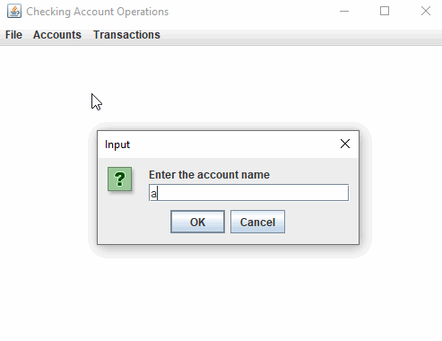

# ATM-Machine
ATM machine written in JAVA with gui interface

* Object oriented atm machine written in java.*
Makes use of Jfram which is part of Oracle's Java Foundation Classes – an API for providing a graphical user interface for Java programs

## User Stories

The following **required** functionality is completed:

- [X] User can write the data to a file
- [X]	User can read data from a file and initialize accounts
- [X] User can add accounts
- [X] User can list all transactions
- [X] User can list all checks created
- [X] User can list all deposites ever made
- [X] User can find/switch different accounts

** App Walkthrough **

 

** Feel free to clone and use any part of my code **
